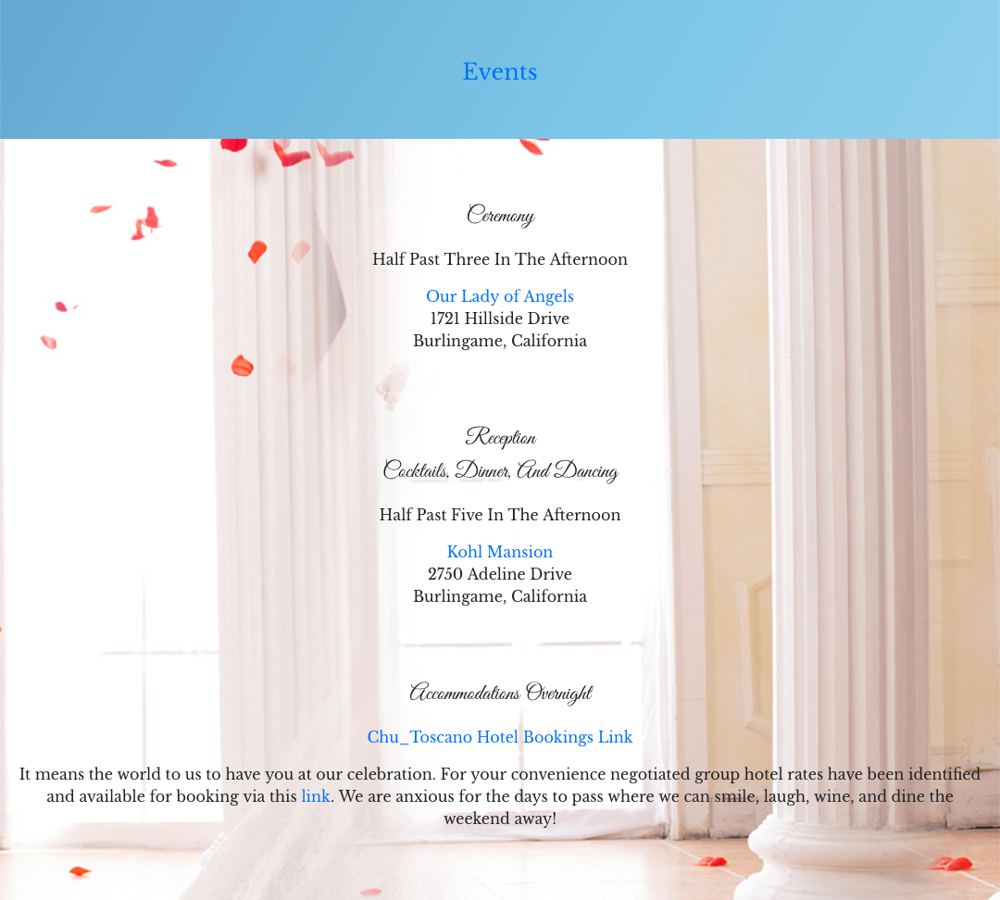
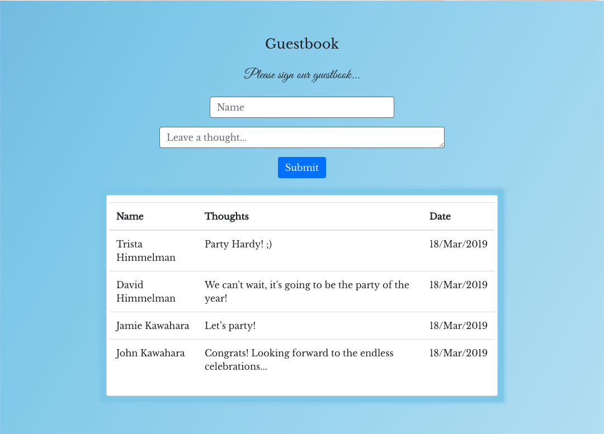
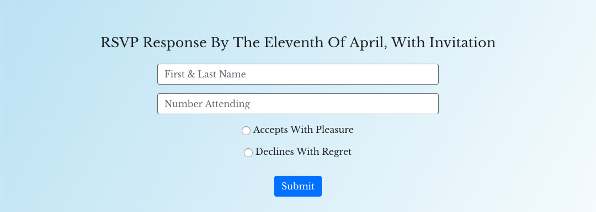
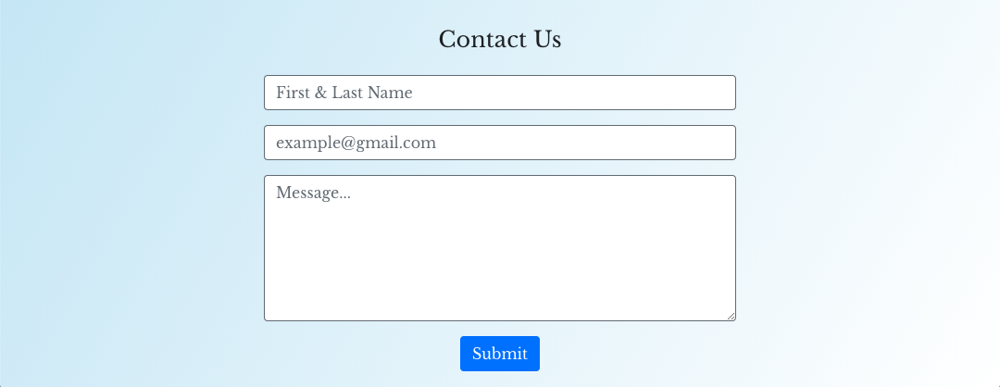

# Live Link to [Chuscanos](https://chuscanos.com)
### 1. Why / Background
  * Chuscanos is a static website for wedding communications.
 ### 2. What / Objectives / User Stories
  * **Technologies**, design through deployment of the application:
    * Client-side: React.js library for component based user interface; Bootstrap framework for HTML/CSS
    * Server-side: N/A
    * Cloud: Firebase DB for realtime data persistence and storage, Formspree for form submissions
  * **Story Map** 
 ### 3. How / Design Description
  * **Project Scope** fit well into [Agile methodology with Scrum and Kanban frameworks](https://en.wikipedia.org/wiki/Agile_software_development). Due to limited scope and solo development, GitHub's built-in tools were not used to support project execution:
    * Projects: Kanban board for documenting user stories and overall progress
    * Issues: Issue tracking for user stories, features and bug report
  * **Functionality** - refer to [video of application user flow](public/assets/readmelinks/appuserflow.webm) - not included
    * View Setup /src
      * Configure React library for single page application leveraging the following reusable components /components
        * Nav 
        * Splash 
        * Timing 
        * Story 
        * Events 
        * Guestbook 
        * Gallery 
        * Registry 
        * RSVP 
        * Footer 
  * **Design Description**
    * Architecture  - not included
    * Data Flow  - not included
    * Model Setup - N/A
    * View Setup (client-side: /public (index.html), /src (index.js, App.js, /components)
      * Use React.js to design App class and required components including state and props to pass to #root element of index.html
      * Import: npm (react, react-bootstrap, firebase, react-firebase-file-uploader, moment), App.css, style.css, /components, firebase, import_images, 
      * Export: App, Events, Footer, Gallery, Nav, Registry, Rsvp, Splash, Story, Timing
    * Controller Setup - N/A
    * Modules
      * Database (/src/components/Guestbook/firebase.js)
        * Initialize Firebase Realtime Database (Guestbook thoughts) and Storage (Gallery file upload)
        * Import: npm (firebase)
        * Export: fire
      * Import Images (/src/components/Gallery/import_images.js, /images_couples, /images_memories)
        * Generate arrays with paths to images to be displayed in Gallery carousels
        * Import: N/A
        * Export: imagesCouple, imagesMemories
  * **Prerequisites for Development:**
    * MacBook Air (Intel Core i7, 2.2 GHz, 1 Processor, 2 Cores, 8GB)
    * 64 bit operating system 
    * git version 2.18.0
    * Visual Studio Code Version 1.32.3
    * [GitHub Repo](https://github.com/jkawahara/chuscanos)
    * Chrome Version 72.0.3626.121 (Official Build) (64-bit)
  * **Built With:**
    * This app was bootstrapped with [Create React App](https://github.com/facebook/create-react-app).
    * Client-side:
      * HTML/CSS/JS
      * [Bootstrap](https://getbootstrap.com/docs/4.2/getting-started/introduction/)
      * [npm](https://www.npmjs.com/)
          * [bootstrap](https://www.npmjs.com/package/bootstrap)
          * [firebase](https://www.npmjs.com/package/firebase)
          * [fs](https://www.npmjs.com/package/fs)
          * [gh-pages](https://www.npmjs.com/package/gh-pages)
          * [jquery](https://www.npmjs.com/package/jquery)
          * [moment](https://www.npmjs.com/package/moment)
          * [path](https://www.npmjs.com/package/path)
          * [popper.js](https://www.npmjs.com/package/popper.js)
          * [react](https://www.npmjs.com/package/react)
          * [react-bootstrap](https://www.npmjs.com/package/react-bootstrap)
          * [react-dom](https://www.npmjs.com/package/react-dom)
          * [react-firebase-file-uploader](https://www.npmjs.com/package/react-firebase-file-uploader)
          * [react-router-dom](https://www.npmjs.com/package/react-router-dom)
          * [react-scripts](https://www.npmjs.com/package/react-scripts)
    * Server-side: N/A
    * Cloud:
      * [Firebase Realtime DB and Storage](https://firebase.google.com/docs/)
      * [GitHub Pages](https://pages.github.com/)
      * [Formspree](https://formspree.io/)
  * **Installing:**
    * For further development or use of this application, clone or download application files from GitHub, which is organized into the following: 
      * Directory structure 
      * /chuscanos (React app specific directories)
        * /build (production build for deployment; ignored by git)
        * /functions (Firebase functions) - N/A
        * /node_modules (ignored by git) - generated first time npm install executes
        * package.json - includes scripts, dependencies, devDependencies
    * Once the application files are ready per the above structure, go to the application root directory level and enter the following in terminal:
      * yarn install
        * Installs required node packages, referring to the included dependencies in respective package.json files and creates required node packages in /node_modules and creates or updates the respective package-lock.json, yarn.lock files.
      * yarn start (react-scripts start)
        * Runs the app in development mode at http://localhost:3000 (React)
      * yarn run deploy (react-scripts build, gh-pages -d build)
        * Runs production build for gh-pages deployment
  * **Running the tests:**
    * Unit testing was informally executed
    * Performance was verified using [PageSpeed Insights](https://developers.google.com/speed/pagespeed/insights/?url=http%3A%2F%2Fchuscanos.com%2F)
      * Mobile average speed score [70 out of 100](public/assets/readmelinks/mobile_pagespeed_insights.pdf)
      * Desktop fast speed score [95 out of 100](public/assets/readmelinks/desktop_pagespeed_insights.pdf)
    * Accessibility was verified using [Total Validator](https://www.totalvalidator.com/)
      * WCVAG2 warning: [W869](https://www.totalvalidator.com/support/reference/wai2.html)
      * WCAG1 error: [P800](https://www.totalvalidator.com/support/reference/section508.html)
      * WCAG1 warning: [W820](https://www.totalvalidator.com/support/reference/wai1.html)
  * **Deployment:**
    * App deployed on [GitHub Pages](https://chuscanos.com)
 ## Versioning
  * For the versions available, see the tags on this repository.
 ## Authors
  * John Kawahara.
  * N/A- See also the list of contributors who participated in this project.
 ## License
  * This project is licensed under the [MIT License](LICENSE).
 ## Acknowledgments
  * Thanks to [Jamie Kawahara](https://github.com/androidgrl) for her guidance and support.
