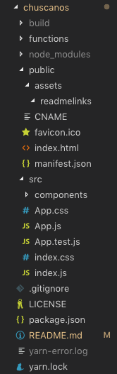

# Live Link to [Chuscanos](https://chuscanos.com)
### 1. Why / Background
  * Chuscanos is a static website for wedding communications.
 ### 2. What / Objectives / User Stories
  * **Technologies**, design through deployment of the application:
    * Client-side: React.js library for component based user interface; Bootstrap framework for HTML/CSS
    * Server-side: N/A
    * Cloud: Firebase DB for realtime data persistence and storage, Formspree
  * **Story Map** 
 ### 3. How / Design Description
  * **Project Scope** fit well into [Agile methodology with Scrum and Kanban frameworks](https://en.wikipedia.org/wiki/Agile_software_development). Due to limited scope and solo development, GitHub's built-in tools were not used to support project execution:
    * Projects: Kanban board for documenting user stories and overall progress
    * Issues: Issue tracking for user stories, features and bug report
  * **Functionality** - refer to [video of application user flow]():
  * **Design Description**
    * Data Flow 
    * Application Setup (server.js)  
  * **Prerequisites for Development:**
    * MacBook Air (Intel Core i7, 2.2 GHz, 1 Processor, 2 Cores, 8GB)
    * 64 bit operating system 
    * git version 2.18.0
    * Visual Studio Code Version 1.29.1
    * [GitHub Repo](https://github.com/jkawahara/chuscanos)
    * Chrome Version 70.0.3538.110 (Official Build) (64-bit)
  * **Built With:**
    * This app was bootstrapped with [Create React App](https://github.com/facebook/create-react-app).
    * Client-side:
      * HTML/CSS/JS
      * [Bootstrap](https://getbootstrap.com/docs/4.2/getting-started/introduction/)
      * [npm](https://www.npmjs.com/)
          * [bootstrap](https://www.npmjs.com/package/bootstrap)
          * [firebase](https://www.npmjs.com/package/firebase)
          * [gh-pages](https://www.npmjs.com/package/gh-pages)
          * [jquery](https://www.npmjs.com/package/jquery)
          * [moment](https://www.npmjs.com/package/moment)
          * [path](https://www.npmjs.com/package/path)
          * [popper.js](https://www.npmjs.com/package/popper.js)
          * [react](https://www.npmjs.com/package/react)
          * [react-bootstrap](https://www.npmjs.com/package/react-bootstrap)
          * [react-dom](https://www.npmjs.com/package/react-dom)
          * [react-firebase-file-uploader](https://www.npmjs.com/package/react-firebase-file-uploader)
          * [react-router-dom](https://www.npmjs.com/package/react-router-dom)
          * [react-scripts](https://www.npmjs.com/package/react-scripts)
    * Server-side: N/A
    * Cloud:
      * [Firebase Realtime DB and Storage](https://firebase.google.com/docs/)
      * [GitHub Pages](https://pages.github.com/)
      * [Formspree](https://formspree.io/)
  * **Installing:**
    * For further development or use of this application, clone or download application files from GitHub, which is organized into the following: 
      * Directory structure 
      * /chuscanos (React app specific directories)
        * /build (production build for deployment)
        * /functions (Firebase functions)
        * /node_modules (ignored by git) - generated first time npm install executes
        * package.json - includes scripts, dependencies, devDependencies
    * Once the application files are ready per the above structure, go to the application root directory level and enter the following in terminal:
      * yarn install
        * Installs required node packages, referring to the included dependencies in respective package.json files and creates required node packages in /node_modules and creates or updates the respective package-lock.json, yarn.lock files.
      * yarn start
        * Runs the app in development mode at http://localhost:3000 (React)
  * **Running the tests:**
    * Unit testing was informally executed
  * **Deployment:**
    * App deployed on [GitHub Pages](https://chuscanos.com)
 ## Versioning
  * For the versions available, see the tags on this repository.
 ## Authors
  * John Kawahara.
  * N/A- See also the list of contributors who participated in this project.
 ## License
  * This project is licensed under the [MIT License](LICENSE).
 ## Acknowledgments
  * Thanks to [Jamie Kawahara](https://github.com/androidgrl) for her guidance and support.
